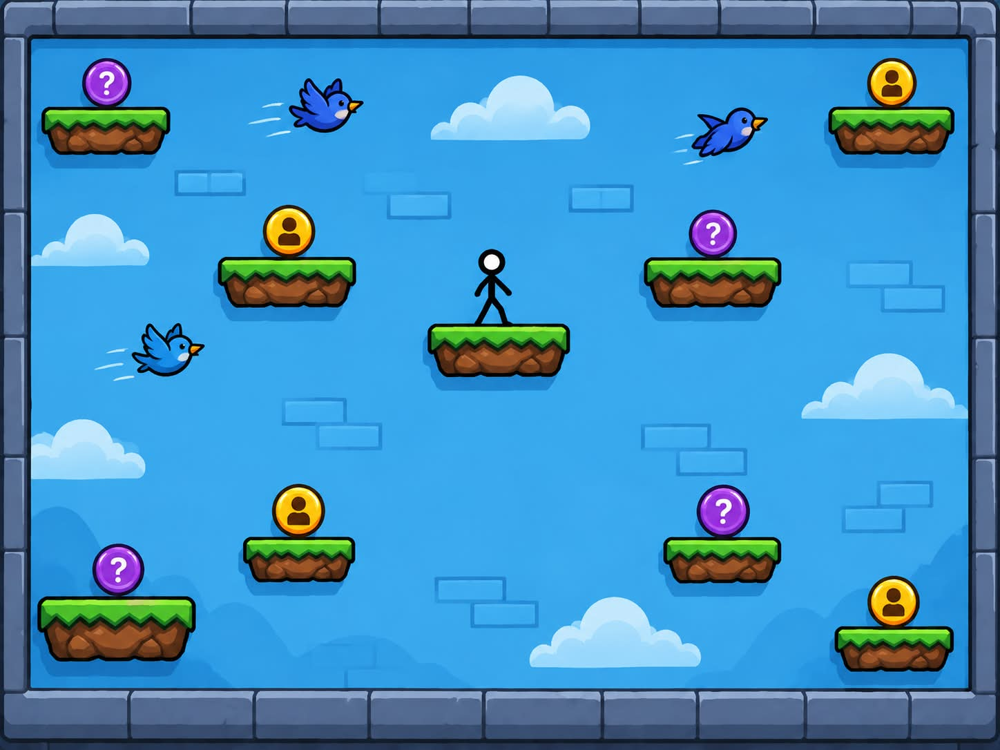

# Salta Monedas 🪙

Juego de plataformas en **HTML, CSS y JavaScript** (sin build system, sin dependencias externas). El personaje salta entre plataformas fijas y recoge monedas para sumar puntos; las monedas moradas plantean preguntas sobre **Salud Mental en los Adolescentes**.



## Cómo jugar

Abre `index.html` directamente en el navegador (rutas relativas, no necesita servidor).

1. Escribe los nombres de los 2 jugadores y pulsa **Jugar**.
2. Cada jugador juega una ronda de **30 segundos** con su propio personaje (color distinto por jugador).
3. Gana quien sume más puntos al final; si empatan, hay empate.

## Mecánica

- **Plataformas fijas**: el personaje se mueve y salta sobre ellas con física de gravedad sencilla.
- **Monedas amarillas** 🟡: aparecen aleatoriamente sobre las plataformas y otorgan **1 punto**.
- **Monedas moradas** 🟣: muestran una pregunta con 3 opciones de respuesta. El puntaje depende de la dificultad:
  - Fácil = 5 puntos
  - Media = 7 puntos
  - Difícil = 10 puntos

## Controles

| Acción   | Teclas                    |
| -------- | ------------------------- |
| Mover    | ← → o **A** / **D**       |
| Saltar   | `Espacio`, ↑ o **W**      |

> El juego pausa correctamente mientras se responde una pregunta (el tiempo no avanza).

## Características

- Fondo, sol, nubes, plataformas, personaje y monedas creados **solo con HTML/CSS/JS**, sin imágenes externas.
- Banco de preguntas en `js/preguntas.js`: **15 preguntas** sobre Salud Mental en los Adolescentes (5 por dificultad). Las medias y difíciles requieren razonamiento/aplicación, no solo memorización.
- HUD con puntaje, tiempo y turno; el tiempo se pone rojo y parpadea en los últimos 10 segundos.
- Interfaz y textos en español.

## Estructura

```
project-game/
├── index.html        # Estructura del juego y overlays (inicio, turno, pregunta, fin)
├── css/
│   └── estilos.css   # Estilos, animaciones y decoración del escenario
├── js/
│   ├── preguntas.js  # Banco de preguntas, puntajes y etiquetas por dificultad
│   └── juego.js      # Lógica del juego: física, monedas, turnos, puntaje y bucle
└── idea.jpg          # Referencia visual del juego
```

## Verificación

- Sin build system, sin tests ni linter configurados.
- Las coordenadas de plataformas, física, monedas y preguntas se ajustan en `js/juego.js` y `js/preguntas.js`.